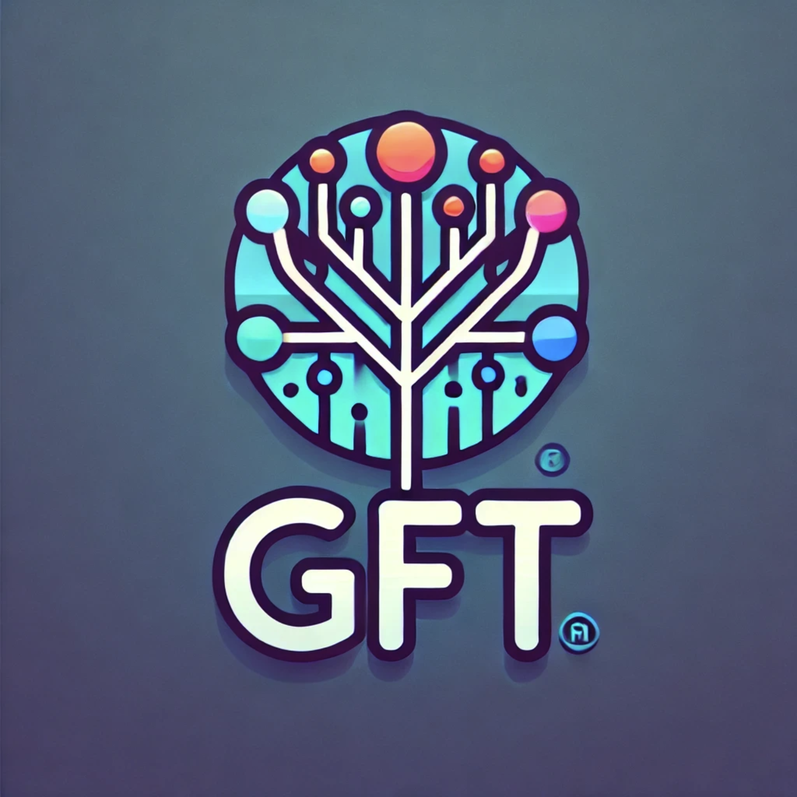
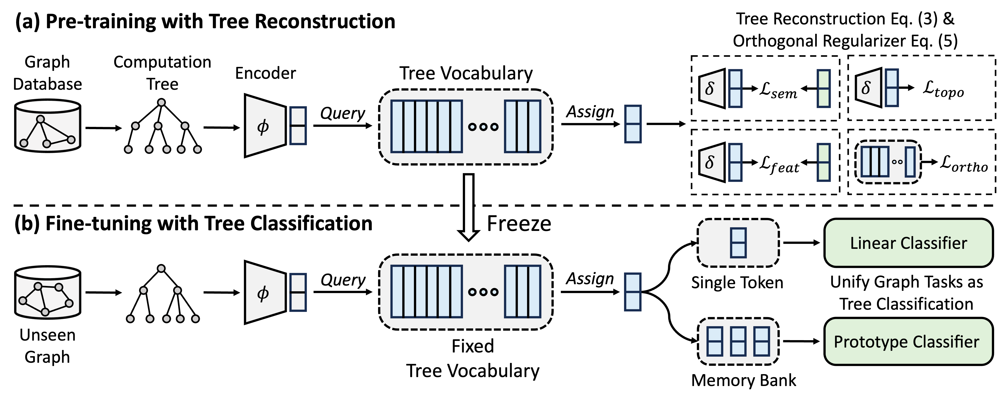
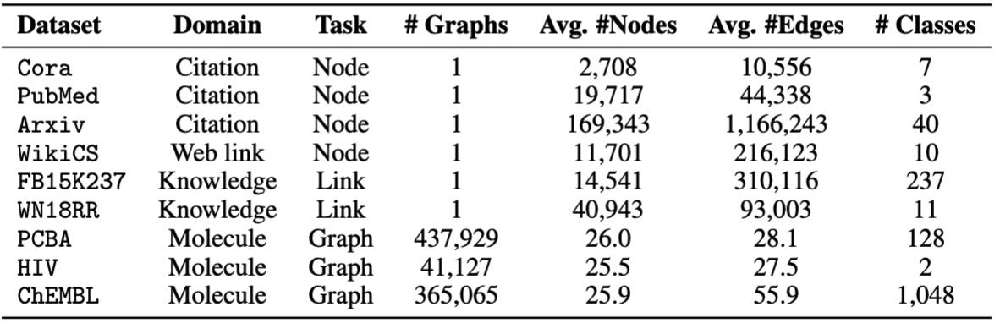

<div align="center">

# GFT: Graph Foundation Model with Transferable Tree Vocabulary

[](https://pytorch.org/get-started/locally/)
[](https://pytorch-geometric.readthedocs.io/en/latest/install/installation.html)

[](https://arxiv.org/abs/2411.06070)

<!-- [](https://arxiv.org/abs/2404.07198) -->

<!-- [](https://huggingface.co/collections/mgalkin/ultra-65699bb28369400a5827669d) -->


</div>

The official implementation of GFT, a cross-domain cross-task foundation model on graphs. The logo is generated by DALL·E 3.

Authored by [Zehong Wang](https://zehong-wang.github.io/), [Zheyuan Zhang](https://jasonzhangzy1757.github.io/), [Nitesh V Chawla](https://niteshchawla.nd.edu/), [Chuxu Zhang](https://chuxuzhang.github.io/), and [Yanfang Ye](http://yes-lab.org/).


## Overview



GFT is a cross-domain and cross-task graph foundation model, which treats computation trees as the transferable patterns to obtain a transferable tree vocabulary. Moreover, GFT provides a unified framework to align graph-related tasks, enabling a single graph model, e.g., GNN, to jointly handle node-level, edge-level, and graph-level tasks.

During pre-training, the model encodes general knowledge from a graph database into a tree vocabulary through a tree reconstruction task. In fine-tuning, the learned tree vocabulary is applied to unify graph-related tasks as tree classification tasks, adapting the acquired general knowledge to specific tasks.

## Installation

You may use conda to install the environment. Please run the following script. We run all experiments on a single A40 48G GPU, yet A GPU with 24G memory is sufficient to handle all datasets with mini-batch.

```
conda env create -f environment.yml
conda activate GFT
```

## Datasets

<div align="center">
    
</div>

We use datasets provided by [OFA](https://github.com/LechengKong/OneForAll). You can run the `pretrain.py` to automatically download the datasets, which will be downloaded to `/data` folder by default. The pipeline will automatically preprocess the datasets by converting textual descriptions to textual embeddings.

Alternatively, you can download our [preprocessed datasets](https://drive.google.com/file/d/18IvieNPWm0ZavSsHvxujXSGFP1tuxRAH/view?usp=sharing) and unzip on the `/data` folder.

<!-- **TODO:** We plan to provide an interface to decompose the data preprocessing and model training, and bring your own dataset. -->

## Quick Start

The code of GFT is presented in folder `/GFT`. The structure is as follows.

```
└── GFT
    ├── pretrain.py
    ├── finetune.py
    ├── dataset
    │   ├── ...
    │   └── process_datasets.py
    ├── model
    │   ├── encoder.py
    │   ├── vq.py
    │   ├── pt_model.py
    │   └── ft_model.py
    ├── task
    │   ├── node.py
    │   ├── link.py
    │   └── graph.py
    └── utils
        ├── args.py
        ├── loader.py
        └── ...
```

You can run `pretrain.py` for pretraining on a wide range of graphs and `finetune.py` for adaptation to certain downstream tasks with basic finetuning or few-shot learning.

To reproduce the results, we provide detailed hyper-parameters for both pretraining and finetuning, maintained in `config/pretrain.yaml` and `config/finetune.yaml`, respectively. To leverage the default hyper-parameters, we provide a command `--use_params` for both pretrain and finetune.

```
# Pretraining with default hyper-parameters
python GFT/pretrain.py --use_params

# Finetuning on Cora with default hyper-parameters
python GFT/finetune.py --use_params --dataset cora

# Few-shot learning on Cora with default hyper-parameters
python GFT/finetune.py --use_params --dataset cora --setting few_shot
```

For finetuning, we provide eight datasets, including `cora`, `pubmed`, `wikics`, `arxiv`, `WN18RR`, `FB15K237`, `chemhiv`, and `chempcba`.

Alternatively, you can run the script to reproduce the experiments.

```
# Pretraining with default hyper-parameters
sh script/pretrain.sh

# Finetuning on all datasets with default hyper-parameters
sh script/finetune.sh

# Few-shot learning on all datasets with default hyper-parameters
sh script/few_shot.sh
```

Note: the pretrained model will be stored in `ckpts/pretrain_model/` by default.

## Pretraining

```
# The basic command for pretraining GFT
python GFT/pretrain.py
```

When you run `pretrain.py`, you can customize the pretraining datasets and hyper-parameters.

### Customize Pretraining Datasets

You can use `--pretrain_dataset` (or `--pt_data`) to set the used pretrain datasets and the corresponding weights. The pre-defined data config is in `config/pt_data.yaml`, with the following structures.

```
all:
  cora: 5
  pubmed: 5
  arxiv: 5
  wikics: 5
  WN18RR: 5
  FB15K237: 10
  chemhiv: 1
  chemblpre: 0.1
  chempcba: 0.1
...
```

In above case, the `all` is the name of the setting, meaning all datasets are used in pretraining. For each dataset, there is a key-value pairs, where the key is the dataset name and the value is the sampling weight. For example, `cora: 5` means the `cora` dataset will be sampled `5` times in a single epoch. You can design your own dataset combination for pretraining GFT.

### Customize Hyper-parameters

You can customize the pretraining phase by altering hyper-parameters of encoder, vector quantization, model training.

- `--pretrain_dataset`: indicate the pretraining dataset. Same to the above.
- `--use_params`: use the pre-defined hyper-parameters.
- `--seed`: the seed used for pretraining.

<details>
  <summary><b>Encoder</b></summary>

- `--hidden_dim`: the dimension in the hidden layer of GNNs.
- `--num_layers`: the GNN layers.
- `--activation`: the activation function.
- `--backbone`: the backbone GNN.
- `--normalize`: the normalization layer.
- `--dropout`: the dropout of GNN layer.

</details>

<details>
  <summary><b>VQ</b></summary>

- `--code_dim`: the dimension of each code in the vocabulary.
- `--codebook_size`: the number of codes in the vocabulary.
- `--codebook_head`: the number of heads of codebook. If the number is larger than 1, you will jointly use multiple vocabularies.
- `--codebook_decay`: the decay rate of codes.
- `--commit_weight`: the weight of the commitment term.

</details>

<details>
  <summary><b>Training</b></summary>

- `--pretrain_epochs`: the number of epochs.
- `--pretrain_lr`: the learning rate.
- `--pretrain_weight_decay`: the weight of the l2 regularizer.
- `--pretrain_batch_size`: the batch size.

</details>

<details>
  <summary><b>Reconstruction</b></summary>

- `--feat_p`: the feature corruption rate.
- `--edge_p`: the edge/structure corruption rate.
- `--topo_recon_ratio`: the ratio of the edges should be reconstructed.
- `--feat_lambda`: the weight of feature loss.
- `--topo_lambda`: the weight of the topology loss.
- `--topo_sem_lambda`: the weight of the topology loss in reconstruction edge features.
- `--sem_lambda`: the weight of the semantic loss.
- `--sem_encoder_decay`: the momentum update rate for the semantic encoder.

</details>

## Adaptation: Finetuning

```
# The basic command for adapting GFT on downstream tasks via finetuning. 
python GFT/finetune.py
```

You can set `--dataset` to indicate the downstream dataset, and `--use_params` to use the pre-defined hyper-parameters for each dataset. Other hyper-parameters you can indicate are presented as follows.

<details>
  <summary><b>Encoder</b></summary>

- `--hidden_dim`: the dimension in the hidden layer of GNNs.
- `--num_layers`: the GNN layers.
- `--activation`: the activation function.
- `--backbone`: the backbone GNN.
- `--normalize`: the normalization layer.
- `--dropout`: the dropout of GNN layer.

</details>

<details>
  <summary><b>VQ</b></summary>

- `--code_dim`: the dimension of each code in the vocabulary.
- `--codebook_size`: the number of codes in the vocabulary.
- `--codebook_head`: the number of heads of codebook. If the number is larger than 1, you will jointly use multiple vocabularies.
- `--codebook_decay`: the decay rate of codes.
- `--commit_weight`: the weight of the commitment term.

</details>

<details>
  <summary><b>Training</b></summary>

- `--finetune_epochs`: the number of epochs.
- `--finetune_lr`: the learning rate.
- `--early_stop`: the maximum early stop epoch.
- `--batch_size`: if set to 0, conduct full graph training.

</details>

<details>
  <summary><b>Classifier</b></summary>

- `--lambda_proto`: the weight of the prototype classifier in finetuning.
- `--lambda_act`: the weight of linear classifier in finetuning.
- `--trade_off`: the trade-off between using prototype classier or using linear classifier in inference.

  You can add `--no_lin_clf` or `--no_proto_clf` to avoid using linear classifier or prototype classifier, respectively. Note these two terms are conflict, as you must use at least one classifier.

</details>

## Adaptation: Few-shot Learning

```
# The basic command for adaptation GFT on downstream tasks via few-shot learning. 
python GFT/finetune.py --setting few_shot
```

You can set `--dataset` to indicate the downstream dataset, and `--use_params` to use the pre-defined hyper-parameters for each dataset. Other hyper-parameters you can indicate are presented as follows.

The hyper-parameters dedicated for few-shot learning are

- `--n_train`: the number of training instances per class for finetuning the model. Note that small `n_train` achieves desirable performance $-$ Cora & WN18RR: 1; Arxiv: 5; HIV & PCBA: 20; FB15K237: 30.
- `--n_task`: the number of sampled tasks.
- `--n_way`: the number of ways.
- `--n_query`: the size of query set per way.
- `--n_shot`: the size of support set per way.

<details>
  <summary><b>Encoder</b></summary>

- `--hidden_dim`: the dimension in the hidden layer of GNNs.
- `--num_layers`: the GNN layers.
- `--activation`: the activation function.
- `--backbone`: the backbone GNN.
- `--normalize`: the normalization layer.
- `--dropout`: the dropout of GNN layer.

</details>

<details>
  <summary><b>VQ</b></summary>

- `--code_dim`: the dimension of each code in the vocabulary.
- `--codebook_size`: the number of codes in the vocabulary.
- `--codebook_head`: the number of heads of codebook. If the number is larger than 1, you will jointly use multiple vocabularies.
- `--codebook_decay`: the decay rate of codes.
- `--commit_weight`: the weight of the commitment term.

</details>

<details>
  <summary><b>Training</b></summary>

- `--finetune_epochs`: the number of epochs.
- `--finetune_lr`: the learning rate.
- `--early_stop`: the maximum early stop epoch.
- `--batch_size`: if set to 0, conduct full graph training.

</details>

<details>
  <summary><b>Classifier</b></summary>

- `--lambda_proto`: the weight of the prototype classifier in finetuning.
- `--lambda_act`: the weight of linear classifier in finetuning.
- `--trade_off`: the trade-off between using prototype classier or using linear classifier in inference.

  You can add `--no_lin_clf` or `--no_proto_clf` to avoid using linear classifier or prototype classifier, respectively. Note these two terms are conflict, as you must use at least one classifier.

</details>

## Reproducibility

The experimental results may vary due to the randomized initialization during pretraining. We provide the experimental results using different random seeds (i.e., 1-5) in pretraining to show the potential impact of random initialization.


|               | Cora          | PubMed        | Wiki-CS       | Arxiv         | WN18RR        | FB15K237      | HIV           | PCBA          | Average |
| ------------------ | ------------------ | ------------------ | ------------------ | ------------------ | ------------------ | ------------------ | ------------------ | ------------------ | ------------------ |
| **Seed = 1** | 78.58 ± 0.90 | 77.55 ± 1.54 | 79.38 ± 0.57 | 72.24 ± 0.16 | 91.56 ± 0.33 | 89.67 ± 0.35 | 72.69 ± 1.93 | 78.24 ± 0.23 | 79.99   |
| **Seed = 2** | 78.27 ± 1.26 | 76.41 ± 1.36 | 79.36 ± 0.62 | 72.13 ± 0.24 | 91.72 ± 0.19 | 89.66 ± 0.31 | 71.62 ± 2.45 | 78.20 ± 0.33 | 79.67   |
| **Seed = 3** | 78.16 ± 1.62 | 76.28 ± 1.37 | 79.32 ± 0.65 | 72.13 ± 0.30 | 91.57 ± 0.44 | 89.78 ± 0.23 | 71.58 ± 2.28 | 78.12 ± 0.37 | 79.62   |
| **Seed = 4** | 78.42 ± 1.37 | 75.76 ± 1.58 | 79.44 ± 0.62 | 72.36 ± 0.34 | 91.70 ± 0.24 | 89.73 ± 0.21 | 72.57 ± 2.46 | 78.34 ± 0.27 | 79.79   |
| **Seed = 5** | 78.56 ± 1.62 | 76.49 ± 2.00 | 79.27 ± 0.55 | 72.18 ± 0.26 | 91.47 ± 0.39 | 89.80 ± 0.19 | 72.27 ± 0.93 | 78.31 ± 0.34 | 79.79   |
| **Reported** | 78.62 ± 1.21 | 77.19 ± 1.99 | 79.39 ± 0.42 | 71.93 ± 0.12 | 91.91 ± 0.34 | 89.72 ± 0.20 | 72.67 ± 1.38 | 77.90 ± 0.64 | 79.92   |

To better ensure the reproducibility, we provide the checkpoints of **Seed = 1** in [this link](https://drive.google.com/file/d/1fuXyHORZLHSwA4PyjoazYYDH4iEk0xYL/view?usp=sharing). We select this due to its best average performance. You can unzip the downloaded file in the path `ckpts/pretrain_model/`, and set the `--pt_seed 1` when using `finetune.py` to delicately leverage our provided checkpoints. 

## Contact Us

Please contact `zwang43@nd.edu` or open an issue if you have questions.

## Citation

If you find the repo is useful for your research, please cite the original paper properly.

```bibtex
@inproceedings{wang2024gft,
  title={GFT: Graph Foundation Model with Transferable Tree Vocabulary},
  author={Wang, Zehong and Zhang, Zheyuan and  Chawla, Nitesh V and Zhang, Chuxu and Ye, Yanfang},
  booktitle={The Thirty-eighth Annual Conference on Neural Information Processing Systems},
  year={2024}, 
  url={https://openreview.net/forum?id=0MXzbAv8xy}
}
```

## Acknowledgement

This repository is based on the codebase of [OFA](https://github.com/LechengKong/OneForAll), [PyG](https://github.com/pyg-team/pytorch_geometric), [OGB](https://github.com/snap-stanford/ogb), and [VQ](https://github.com/lucidrains/vector-quantize-pytorch). Thanks for their sharing!
